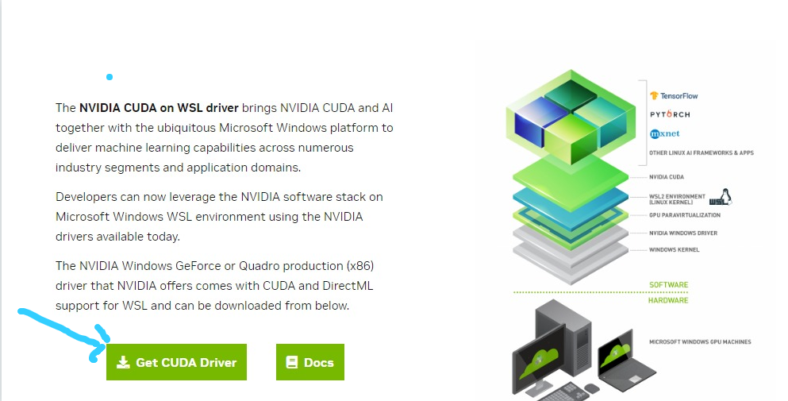
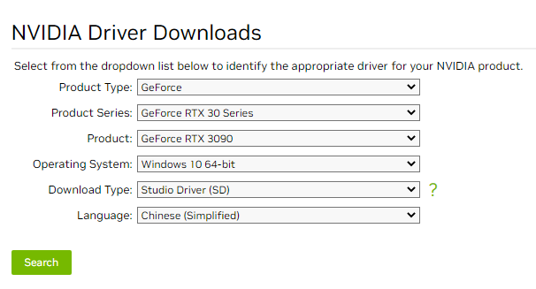

# Windows 安装Nvidia-Docker GPU 驱动Paddlepaddle
   
   
### 1. 安装最新的显卡驱动 
:blush:
查看自己电脑显卡型号 <br>
[nvidia](https://developer.nvidia.com/cuda/wsl)上去下载


### 2. 安装WSL2
参考内容 https://learn.microsoft.com/zh-cn/windows/wsl/install-manual

选择子系统

推介Ubuntu 20.04 LTS https://www.microsoft.com/store/apps/9n6svws3rx71

下載Linux 內核更新包 https://wslstorestorage.blob.core.windows.net/wslblob/wsl_update_x64.msi

下载后双击点击安装
```shell
# 启动管理员PowerShell
Start-Process powershell -Verb runAs
```

```shell
# 启用 wsl 低於18362 的版本不支持WSL 2
dism.exe /online /enable-feature /featurename:Microsoft-Windows-Subsystem-Linux /all /norestart
# 启用虚拟机
dism.exe /online /enable-feature /featurename:VirtualMachinePlatform /all /norestart
# 设置 wsl 默认版本
wsl --set-default-version 2
```

参考内容 https://learn.microsoft.com/zh-cn/windows/wsl/install-manual

选择子系统

推介Ubuntu 20.04 LTS https://www.microsoft.com/store/apps/9n6svws3rx71

双击点击安装


```shell
# 子系统打包 移动到自己的文件夹

# 查看列表
wsl --list
# wsl --export <导出的系统名称> <导出的位置>
wsl --export Ubuntu D:\WSL\Ubuntu.tar
# 卸载 Ubuntu 
wsl --unregister Ubuntu
# 导入 <名字> <安装路径> <tar 路径>
wsl --import Ubuntu  C:\Ubuntu D:\backUp\Ubuntu.tar
wsl --list

# 进入子系统
bash
# 查看是否有显卡驱动
nvidia-smi
```

### 3. 安裝cuda
根据nvidia-smi 选择CUDA版本
https://developer.nvidia.com/cuda-toolkit-archive

这里选择11.7.0

进入选择Linux -> x86_64 -> WSL-Ubuntu -> 2.0 -> runfile(local)

```shell
# 可选操作，如果国内网速太慢请更换国内代理

```


```shell
# 安装gcc Cuda 安装需要
apt install -y build-essential
# 提示软链接错误无需理会
# 下载和安装
wget https://developer.download.nvidia.com/compute/cuda/repos/wsl-ubuntu/x86_64/cuda-wsl-ubuntu.pin
sudo mv cuda-wsl-ubuntu.pin /etc/apt/preferences.d/cuda-repository-pin-600
sudo apt-key adv --fetch-keys https://developer.download.nvidia.com/compute/cuda/repos/wsl-ubuntu/x86_64/3bf863cc.pub
sudo add-apt-repository "deb https://developer.download.nvidia.com/compute/cuda/repos/wsl-ubuntu/x86_64/ /"
sudo apt-get update
sudo apt-get -y install cuda
```

```shell
# 修改环境变量
vim ~/.bashrc

# 文件未追加
export PATH=/usr/local/cuda/bin${PATH:+:${PATH}}
export LD_LIBRARY_PATH=/usr/local/cuda/lib64${LD_LIBRARY_PATH:+:${LD_LIBRARY_PATH}}

# reload 环境变量配置
source ~/.bashrc

# 检查是否生效
nvcc -V
```

```shell
# 测试cuda 
apt install -y git
cd /home
git clone https://github.com/NVIDIA/cuda-samples.git
cd /home/cuda-samples/Samples/1_Utilities/deviceQuery
make
./deviceQuery

# 输出Pass 则成功了
```

### 4. nvidia-docker安裝
```shell
curl https://get.docker.com | sh 
distribution=$(. /etc/os-release;echo $ID$VERSION_ID) \
   && curl -s -L https://nvidia.github.io/nvidia-docker/gpgkey | sudo apt-key add - \
   && curl -s -L https://nvidia.github.io/nvidia-docker/$distribution/nvidia-docker.list | sudo tee /etc/apt/sources.list.d/nvidia-docker.list
sudo apt update
sudo apt-get install nvidia-docker2
sudo systemctl restart docker
service docker start
```

https://hub.docker.com/r/nvidia/cuda
上去找属于自己CUDA版本的docker 镜像
```shell
# nvidia-docker 测试
sudo docker run -idt --name nvidia_docker_test --gpus all --shm-size 16G nvidia/cuda:11.7.1-base-ubuntu22.04
sudo nvidia-docker start nvidia_docker_test
sudo nvidia-docker attach nvidia_docker_test
# 查看是否有显卡驱动
nvidia-smi
# 有则判定 nvidia-docker 已经成功安装和使用
exit
```


### 5. PaddleDetection
可以在 https://www.paddlepaddle.org.cn/install/quick?docurl=/documentation/docs/zh/install/install_NGC_PaddlePaddle_ch.html
拉取PaddleDetection 镜像我选择CUDA11.7的

```shell
cd /home
git clone https://github.com/PaddlePaddle/PaddleDetection.git
docker run --gpus all --shm-size=1g --ulimit \
memlock=-1 -it --name Test -v /home/PaddleDetection:/home/PaddleDetection
--rm nvcr.io/nvidia/paddlepaddle:22.10-py3
cd /home/PaddleDetection
pip install -r requirements.txt -i https://pypi.tuna.tsinghua.edu.cn/simple some-package
# 在GPU上预测一张图片
export CUDA_VISIBLE_DEVICES=0
python tools/infer.py -c configs/ppyolo/ppyolo_r50vd_dcn_1x_coco.yml -o use_gpu=true weights=https://paddledet.bj.bcebos.com/models/ppyolo_r50vd_dcn_1x_coco.pdparams --infer_img=demo/000000014439.jpg
```